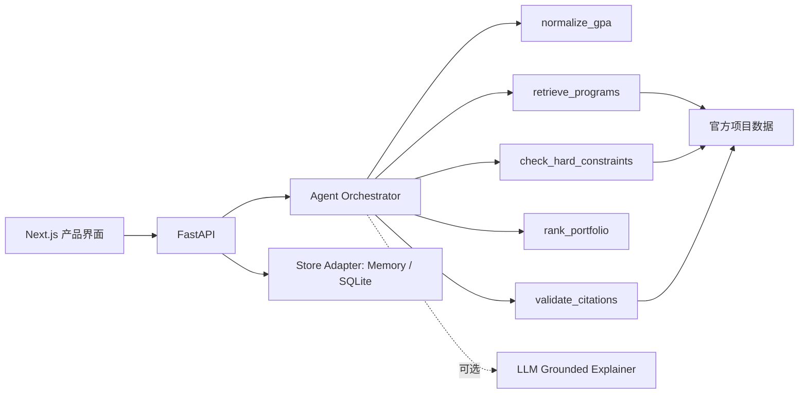

# OfferPilot — 可验证的留学申请规划 Agent

OfferPilot 是一个完整的留学申请规划 Web 产品 Demo。用户登录并填写背景后，系统检索具体硕士项目，调用确定性 Python 工具检查 GPA、院校背景、专业相关性、先修课和语言要求，再生成带官方来源的申请组合、项目分析与行动计划。

> 匹配分不是录取概率。最低门槛、名额和课程信息可能变化，最终以项目官网及学校正式审核为准。

## 在线体验

- Demo：https://offerpilot-study.jammy-mole-2081.chatgpt.site
- FastAPI 文档：本地启动后访问 http://localhost:8000/docs

## 产品流程

1. Demo 登录
2. 填写或修改申请背景
3. 查看 Agent 的 5 步运行轨迹
4. 查看项目级冲刺、匹配、稳妥与暂不推荐结果
5. 打开项目详情与官方证据
6. 查看申请行动计划
7. 回看历史 Agent Runs

## Agent 架构



核心设计原则：

- Agent 负责编排、补充信息判断和解释。
- 硬门槛由可测试的 Python 工具处理，LLM 不能修改档位、分数或引用。
- 每条推荐绑定官方项目页、来源编号、摘录和核验日期。
- 工具或模型不可用时显式降级，不静默伪造结论。

## 两种运行模式

### `deterministic-demo`

默认模式，不需要模型密钥。完整执行同一组工具、输出 Schema 和引用校验，适合稳定的在线演示与自动化测试。

### `llm-assisted`

配置兼容 OpenAI 的模型后启用。模型只基于已验证工具结果生成总结；硬门槛和排序仍由确定性工具完成。模型请求失败会安全降级为 Demo 模式。

```env
AGENT_MODE=llm-assisted
OPENAI_API_KEY=your-key
OPENAI_BASE_URL=https://api.openai.com/v1
OPENAI_MODEL=gpt-4.1-mini
```

## 首批项目数据

当前维护 6 个计算机与数据方向项目：

- UNSW — Master of Information Technology
- University of Sydney — Master of Computer Science
- Monash — Master of Artificial Intelligence
- Monash — Master of Computer Science
- UQ — Master of Data Science
- UWA — Master of Information Technology

每条数据均包含官方 URL、门槛摘录、先修要求、英语要求和核验日期。数据位于 `api/app/program_data.py`；前端保留同规则 fallback，用于 Python API 未部署时的公开演示。

## Eval 结果

固定 Eval 集包含相关/非相关专业、高中低 GPA、4 分制换算、双非特殊门槛、语言缺失和经历缺失等 10 个案例。

| 指标 | 结果 |
|---|---:|
| 固定案例数 | 10 |
| 硬门槛判断准确率 | 100% |
| 缺失信息识别准确率 | 100% |
| 官方引用覆盖率 | 100% |
| 核心工具成功率 | 100% |
| 本地平均确定性运行时间 | < 0.2 ms |

以上结果由 `api/evals/run_eval.py` 在 2026-07-14 实际运行得到；CI 会重新运行质量门槛。小型固定集只用于防止规则回归，不代表真实录取预测能力。

## 技术栈

- 前端：Next.js App Router、React 19、TypeScript、Tailwind CSS
- API：FastAPI、Pydantic v2
- Agent：显式 Plan-and-Execute 工作流 + 可插拔模型 Provider
- 测试：Node Test Runner、pytest、固定 Agent Eval
- 持久化：Repository 抽象、进程内 Demo Store、可选 SQLite Store
- 工程化：GitHub Actions、Sites 前端部署、Vercel Services 全栈配置

## 本地运行

需要 Node.js 22.13+、pnpm 11 和 Python 3.12+。

```bash
pnpm install
pnpm dev
```

另开终端启动 API：

```bash
cd api
python -m venv .venv
source .venv/bin/activate
pip install -r requirements.txt
uvicorn app.main:app --reload
```

复制环境变量示例：

```bash
cp .env.example .env.local
```

前端配置 `NEXT_PUBLIC_API_URL=http://localhost:8000` 后会连接 FastAPI。连接失败时界面会明确显示 `Demo fallback`，并继续使用同规则的浏览器会话演示。

如需让 API 重启后继续保留资料和推荐历史，配置：

```env
DATABASE_PATH=./data/offerpilot.db
```

SQLite 适配器会自动建表，并通过 `user_id` 隔离 Profile 与 Agent Run。它适合本地 Demo、单机部署和面试演示；无状态云函数应改接托管 PostgreSQL。

## 全栈部署结构

仓库根目录的 `vercel.json` 定义了两个同域服务：

- `/` → Next.js Web
- `/api` → FastAPI

Vercel Services 会向前端注入 `NEXT_PUBLIC_API_URL=/api`，因此线上请求不需要额外 CORS。部署项目需要在 Vercel 中选择 **Services** Framework Preset。现有 Sites 链接继续作为无需后端的稳定产品预览。

## API

公共接口：

- `GET /health`
- `POST /auth/login`
- `GET /programs`
- `GET /programs/{slug}`
- `POST /agent/recommendations`

登录后接口：

- `GET /me/profile`
- `PUT /me/profile`
- `POST /me/recommendation-runs`
- `GET /me/recommendation-runs`
- `GET /me/recommendation-runs/{run_id}`
- `GET /me/recommendation-runs/{run_id}/action-plan`

## 验证

```bash
pnpm run lint
pnpm test

cd api
.venv/bin/pytest -q
PYTHONPATH=. .venv/bin/python evals/run_eval.py
```

## Demo 限制

- 当前登录是明确标注的 Demo Auth，不是生产级身份系统。
- 未配置 `DATABASE_PATH` 时，Profile、历史记录和行动计划使用进程内 Store；API 重启会清空。
- SQLite 可跨进程重启保留数据，但不适合作为无状态云函数的共享生产数据库。
- 在线站点在 FastAPI 未单独部署时使用浏览器会话 fallback，刷新会清空。
- 当前没有 PDF/OCR 成绩单解析、自动爬虫、文书生成和录取概率预测。
- 正式版本应替换 Demo Auth，并把 SQLite Adapter 扩展为托管 PostgreSQL，同时增加迁移和来源变更监控。

完整一天版产品规格见 [PRD.md](./PRD.md)。

## License

MIT
