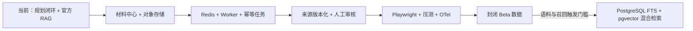

# OfferPilot 大厂 Agent / AI 应用实习项目评估

评估日期：2026-07-17  
代码基线：`0788566` 及其之前的 15 个本地提交  
目标：成为可信、可演示、可解释、有工程深度的完整留学申请产品，而不是中间件陈列项目。

## 一句话结论

OfferPilot 已经超过普通“LLM 套壳 Demo”：它有完整账户、档案、选校、申请组合、路线图、顾问、官方来源 RAG、持久化、CI 和部署设计。目前足以作为 Agent 实习简历项目进入投递版，但还不是公开 Beta 的最终上线版。

当前最值得继续投入的不是 Kubernetes、Kafka 或独立向量数据库，而是：

1. 材料中心与对象存储，把产品从“规划”推进到“真实申请执行”。
2. 浏览器 E2E、PostgreSQL 并发和恢复演练，证明完整链路可靠。
3. Redis + Worker，在多实例限流、AI 配额、材料解析和提醒任务出现时再引入。
4. 官方来源的版本化采集与人工审核，把 6 个已核验项目扩展为可维护的数据产品。

## 当前可量化成果

| 维度 | 当前状态 |
|---|---|
| 产品范围 | 登录、邮箱验证、档案、推荐、组合、首选、路线图、任务、顾问、RAG、反馈、后台、数据导出/删除 |
| API | FastAPI，约 51 个路由 |
| 数据 | Memory / SQLite / PostgreSQL 三套 Store；PostgreSQL JSONB；Alembic |
| 课程范围 | 澳洲八大 384 个目录覆盖单元；6 个课程级已核验项目 |
| RAG | 18 个官方知识块；BM25；来源、摘录、核验日期与诚实拒答 |
| Agent Eval | 推荐 10 条、顾问 24 条、RAG 17 条，共 51 条固定 Eval |
| 自动测试 | 后端 65 passed、2 个 PostgreSQL 集成项本机跳过；前端 15 passed |
| 构建 | TypeScript、ESLint、Next.js production build、Compose 配置均通过 |
| 本地提交 | 相对 `origin/main` 领先 15 个小步提交，提交作者一致 |

两个需要诚实说明的数字：

- “384 个覆盖单元”是学校 × 学位 × 专业大类的官方目录入口，不等于 384 个已核验项目。
- 当前真正进入详细资格判断与 RAG 的是 6 个项目、18 个知识块。

## 本轮关闭的关键问题

- 后端推荐成为前端展示与历史恢复的唯一事实来源，删除浏览器重复录取规则。
- 云模型只允许从“用户独立同意 + 统一脱敏 + SSE 顾问”边界调用。
- 修复 Cookie 登录下流式顾问被假 Bearer token 覆盖的问题。
- 登录后恢复持久化档案与历史，不再让示例数据覆盖真实用户数据。
- 增加官方来源 RAG、可见引用、固定检索 Eval 与库外问题拒答。
- 限流不再默认信任客户端伪造的 `X-Forwarded-For`；Cookie 写请求增加来源校验。
- “多个确定申请 + 一个首选”在 Memory、SQLite 和 PostgreSQL 中改为原子写入。
- 同步数据库操作移出 SSE 事件循环；路线图 GET 不再产生写副作用。
- Agent eligibility 现在真正考虑均分最低线、专业背景、先修课、语言总分和小分证据。
- 前端 Agent 页面展示后端真实 tool trace，删除固定计时器假进度。
- 推荐 run 保存档案快照，历史方案可以按当时输入复现。
- 预算字段从错误的 AUD 语义迁移为 CNY，并兼容旧 JSON 数据。
- DeepSeek 改成可选能力；生产模板无 Key 也能以确定性模式部署。
- 注册 debug token 改成显式本地开关；生产配置禁止打开。
- Web 与 API 容器改为非 root 用户运行。

## 当前最强的简历亮点

### 1. Agent 不是直接让模型决定录取

GPA 归一化、最低线判断、专业背景、先修课程、项目排序和写操作都由确定性 Python 工具处理。模型只负责解释，且不能改变硬门槛结果。这是比“Prompt + Chat UI”更成熟的架构取舍。

### 2. 有可审计的数据与模型边界

推荐结果包含 workflow version、tool trace、引用和档案快照；顾问记录 provider、model、prompt version、latency、tokens 与工具。云模型入口还有 consent、PII 脱敏和白名单写工具。

### 3. RAG 有来源、有拒答、有 Eval

当前语料规模很小，因此选择中英别名 + 中文双字切分 + BM25，而没有为了简历硬上向量库。每个命中都携带官方 URL 与核验日期；低相关和库外问题返回无答案。这个“为什么暂时不用 pgvector”的取舍在面试中很有价值。

### 4. 产品闭环比单点 Agent 更完整

用户能从注册、档案、选校进入申请组合，再进入横向路线图、学校分支和任务，顾问可在白名单内修改档案、组合或任务。它已经是一个产品骨架，而不是独立聊天页。

## 离公开 Beta 仍缺什么

### P0：发布前必须完成

| 缺口 | 为什么重要 | 最小可信实现 |
|---|---|---|
| 浏览器 E2E | 组件构建通过不等于真实 Cookie、刷新、SSE 全链路通过 | Playwright 覆盖注册→验证→登录→档案→方案→首选→路线图→刷新→RAG |
| PostgreSQL 实机集成 | 本机 Docker 未启动，2 条集成测试跳过 | 在 CI 和可用 Docker 环境验证 Alembic、账户、原子首选与并发 |
| 公开全栈部署 | 纯静态站点无法提供真实账户和 Agent | Web、FastAPI、PostgreSQL 同域部署；发布后 smoke test |
| 材料中心 MVP | 真实申请的最大痛点是材料，不只是选校 | 私有对象存储、文件元数据、文本 PDF 解析、用户确认、跨用户隔离 |
| 官方数据运营流程 | 当前事实仍是代码种子，更新依赖开发者 | URL、内容 hash、版本 diff、人工审核、发布/回滚状态 |

### P1：能显著体现工程能力

| 能力 | 建议 |
|---|---|
| Redis | 多 API 副本或付费模型公开流量时，用于共享限流、每日配额、全局并发租约和幂等 Key |
| Worker / 异步任务 | 材料解析、邮件重试、官方页面复核和到期提醒出现后，用 RQ/Dramatiq + Redis 或 Postgres outbox |
| 数据库连接池 | 当前生产 Store 仍是单同步连接；应改为连接池或明确 async repository，并做故障重连 |
| API Contract | 用 OpenAPI 生成 TypeScript client，避免手写类型与后端字段漂移 |
| 可观测性 | 增加 TTFT、总延迟、DB/tool duration、fallback、token/cost 与端到端 correlation |
| 压测 | Locust/k6 覆盖登录、推荐、长对话、5 路 SSE、429 与数据库故障 |
| 容灾 | 异地加密备份、自动 restore 演练，并定义 RPO/RTO |
| 发布闭环 | staging、post-deploy smoke、rollback 与镜像/SBOM 扫描 |

### P2：条件满足后再做

- pgvector：已核验项目达到约 200 个、接入网页/PDF 长文档，或 BM25 Recall@3 明显下降后，引入混合检索。
- MCP：出现真实外部 Agent、IDE 或第三方调用方后，把现有白名单工具暴露为 MCP。
- LangGraph / Temporal：出现长任务、人工暂停/恢复或跨服务补偿后再引入。
- Kubernetes：出现多副本、明确 SLO、滚动发布与资源调度需求后再评估。

### 当前不建议

- 为 18 个知识块部署独立向量数据库。
- 为少量提醒引入 Kafka。
- 在单机封闭 Beta 上 Kubernetes 或 Service Mesh。
- 自动代投学校、自动给导师发邮件。
- 在澳洲八大数据还未做深前扩展所有国家。

## 推荐的技术演进顺序

## 1 天 / 3 天 / 1 周里程碑

### 再投入 1 天

- 修复本机 Docker Desktop 或在 CI 验证 PostgreSQL 集成项。
- 补 Playwright 主旅程与断流/刷新恢复。
- 部署一个全栈测试域名，邀请 3–5 位熟人完成任务。
- 记录主流程完成率、阻断错误与 RAG 无答案查询。

### 再投入 3 天

- 完成材料中心元数据、私有上传与跨用户隔离。
- 接入 MinIO/S3 兼容对象存储和文本 PDF 解析状态机。
- 增加 Redis + Worker，支持幂等、重试、失败状态和进度查询。
- 做第一轮官方来源版本与人工审核后台。

### 再投入 1 周

- 建立浏览器 E2E、PostgreSQL 并发、迁移、备份恢复与 k6/Locust 门禁。
- 增加 OpenTelemetry 核心 trace/metrics 和运营指标。
- 封闭 Beta 5–10 人，基于真实匿名问题扩充 Agent/RAG Eval。
- 根据 Beta 数据决定是否扩大课程级项目与引入 pgvector。

## 简历写法建议

项目标题：`OfferPilot — 面向澳洲留学申请的可审计 Agent 工作台`

可写成：

- 使用 Next.js、FastAPI 与 PostgreSQL 构建覆盖账户、档案、项目推荐、申请组合、路线图和 AI 顾问的全栈产品，设计约 51 个 API 路由与多层持久化适配器。
- 将 GPA、硬门槛、先修课程和组合写操作实现为确定性工具，LLM 仅在用户独立同意及统一脱敏边界后参与解释，避免模型修改录取事实。
- 实现带官方 URL、摘录和核验日期的 BM25 RAG，并建立 17 条检索/拒答 Eval；与 10 条推荐、24 条顾问 Eval 一起纳入 CI。
- 设计“多个确定申请 + 唯一首选”的跨实例原子更新、SSE 流式降级、审计追踪、CSRF/可信代理边界和非 root 容器运行。

不要写：

- “覆盖 384 个真实项目要求”——实际是 384 个目录覆盖单元、6 个已核验项目。
- “使用 DeepSeek V4 生产服务”——真实 API 接入与实网延迟测试仍暂缓。
- “向量数据库 RAG”——当前实现是更适合小语料的 BM25。
- “录取概率预测”——匹配分不是概率。

## 面试重点讲什么

1. 为什么录取硬门槛不用 LLM：确定性、可测试、可复现、可审计。
2. 为什么 18 个知识块不用向量数据库：BM25 更简单、更快、可解释；先用 Eval 定义升级门槛。
3. 如何防止模型越权写数据：白名单工具、Pydantic 校验、显式用户意图、服务端执行。
4. 如何处理隐私：独立 consent、最小化上下文、统一脱敏、原始成绩单不出境、API Key 只在服务端。
5. 为什么 Redis 现在不直接加入：单实例没有一致性收益；多副本配额与异步任务出现时再引入。
6. SSE 失败怎样降级：首 Token/总时限、429/余额异常、显式 error 事件、确定性规则回答，不隐式等待本地模型。
7. 历史方案怎样复现：保存 workflow version、完整项目事实、来源和 profile snapshot。

## 最终判断

如果今天投递，这个项目已经能证明：

- 你能做完整前后端产品，而不是只会 Prompt。
- 你懂 Agent 工具边界、RAG、Eval、隐私、安全和失败降级。
- 你能做技术取舍，不会为了简历堆 Redis、Kafka、向量库和 Kubernetes。

下一次最能提高项目含金量的交付是“材料中心 + 异步解析 + 浏览器 E2E”，不是再换一个更大的模型。
