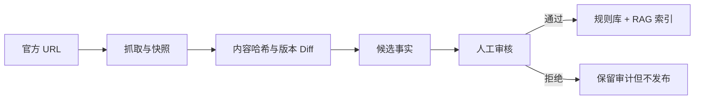

# OfferPilot 高价值新需求与产品路线

## 结论

下一阶段不应该继续横向堆学校、模型和中间件，而应该把用户从“看到选校建议”真正推进到“完成一次可提交的申请”。最有价值的三条产品主线是：

1. 材料中心：上传、解析、核对和复用成绩单/CV/文书。
2. 官方证据中心：持续更新、检索、引用和人工复核项目要求。
3. 申请执行中心：截止日期、提醒、材料版本和学校分支进度。

它们同时能自然引出对象存储、Redis、异步任务、RAG、可观测性和压测，技术栈与真实产品问题是一一对应的。

## 已完成的本轮基础

- 后端 Agent 结果已经成为前端选校与历史方案的唯一事实来源。
- 所有云模型调用被限制在“独立同意 + 统一脱敏 + 流式顾问”出口。
- 修复流式请求用假 Bearer token 覆盖 HttpOnly Cookie 的鉴权断点。
- 登录后恢复真实档案与历史，不再用示例资料覆盖用户数据。
- 上线官方知识 RAG：项目/章节检索、可见来源、核验日期、规则降级回答和 12 条 Eval。

## 优先级总表

| 优先级 | 需求 | 用户问题 | 建议技术 | 成功指标 |
|---|---|---|---|---|
| P0 | 材料中心 MVP | 资料散落、重复填写、无法判断是否齐全 | MinIO/S3、PostgreSQL、异步解析 | 80% 测试用户能上传并确认一份成绩单 |
| P0 | 浏览器端主流程 E2E | 页面能构建但完整流程可能在真实浏览器断掉 | Playwright、固定测试账户 | 登录到路线图刷新恢复全链路通过 |
| P0 | 官方来源入库与复核 | 项目事实只有代码种子，更新依赖开发者 | 管理后台、内容哈希、版本 diff、审核状态 | 每条发布事实有来源、版本和审核人 |
| P1 | Redis 共享状态 | 多 API 实例的限流、配额和并发不一致 | Redis | 双实例下限流和每日配额仍严格一致 |
| P1 | 文档解析任务 | PDF/OCR 会阻塞请求且可能失败 | Dramatiq/RQ、Redis、重试与死信 | 任务可重试、可取消、刷新后状态不丢 |
| P1 | 截止日期与提醒 | 路线图有日期但不会主动提醒 | 后台任务、邮件、ICS、幂等键 | 到期提醒只发送一次，用户可关闭 |
| P1 | RAG 反馈与可观测性 | 无法知道检索是否真的解决问题 | Trace、检索指标、赞踩反馈 | 无答案拒答率与 Recall@3 可持续观察 |
| P1 | 研究型申请工作台 | 研究硕博需要导师、研究计划与联系记录 | 结构化导师证据、版本管理 | 能完成导师 shortlist → 联系 → 跟进闭环 |
| P2 | 只读分享链接 | 用户需要和老师、朋友共同检查方案 | 短期签名 token、权限与审计 | 分享者不能修改或看到账号隐私 |
| P2 | 预算情景比较 | 选校不只是门槛，也受生活成本影响 | 可配置预算模型、来源引用 | 每个数字能回到来源和币种日期 |

## 需求一：材料中心 MVP

### 用户故事

用户可以上传成绩单、CV、语言成绩、护照和作品集，看到每份材料的解析状态、适用学校、缺失字段、版本和最后更新时间。系统先让用户确认提取结果，再把结构化课程或经历写入申请档案。

### 最小范围

- 文件类型：PDF、JPG、PNG、DOCX；单文件最大 15 MB。
- 材料类型：成绩单、CV、语言成绩、身份证明、个人陈述、推荐信、作品集。
- 状态：已上传 → 待解析 → 待用户确认 → 已确认 → 解析失败。
- 原始文件进入私有对象存储，数据库只存元数据、对象 Key、哈希和解析结果。
- 第一个解析器只做文本型 PDF 成绩单；扫描版进入明确的“需要 OCR”状态。
- 原始文件和原始成绩单文本不进入 DeepSeek 上下文。

### 数据模型

- `ApplicationDocument`：用户、类型、文件名、MIME、大小、SHA-256、对象 Key、状态、版本、创建时间。
- `DocumentExtraction`：解析器版本、结构化字段、置信度、警告、确认状态。
- `DocumentUsage`：材料版本与学校/项目/申请任务的关联。

### 验收

- 跨用户访问对象或元数据返回 404。
- 重复文件根据哈希提示，不悄悄生成多份。
- 上传中断可以重试；解析失败不影响材料中心其他文件。
- 用户确认前，解析结果不能自动修改档案。
- 删除账户时同步删除对象与解析记录。

## 需求二：官方来源入库、版本与审核

### 用户故事

运营人员提交项目官方 URL，系统保存页面快照和内容哈希，提取候选事实并展示与上一版本的差异。只有人工确认的事实才进入推荐规则和 RAG 索引。

### 核心流程

### 验收

- 非学校官方域名默认不能发布为录取门槛来源。
- 页面变更不会自动覆盖线上门槛，只生成待审核版本。
- 每个事实记录来源 URL、证据摘录、抓取时间、审核人、审核时间和有效期。
- RAG 结果能定位到发布版本，而不只是当前 URL。
- 超过复核周期的事实仍可查询，但必须显示“需要复核”。

## 需求三：Redis 与异步任务

Redis 不单独作为“功能”上线，而作为以下真实能力的共享状态层：

- 登录/认证和普通 API 的跨实例滑动窗口限流。
- AI 顾问每日配额、全局并发租约和幂等请求 Key。
- 文件解析任务的队列、进度、重试退避和取消标记。
- 官方来源抓取、过期复核和提醒邮件调度。
- 热门公开知识查询的短 TTL 缓存；用户私有回答默认不缓存。

任务执行推荐先用 Dramatiq 或 RQ，而不是 Celery 全家桶。当前任务规模较小，优先获得清晰的重试、幂等和可观察状态；当出现复杂跨天工作流和人工等待节点时，再评估 Temporal。

### 验收

- 相同幂等 Key 的上传解析或提醒任务最多执行一次。
- Worker 崩溃后任务能恢复；超过重试次数进入可见失败状态。
- Redis 不可用时登录与查看历史仍可工作，限流进入保守模式，后台任务明确暂停。
- 任务日志不记录材料全文、邮箱或模型 Key。

## 需求四：申请执行中心

### 新能力

- 学校官方截止日期与系统建议日期并列显示，来源和覆盖关系清楚。
- 任务可关联具体材料版本，例如“UNSW 使用 CV v3”。
- 提醒支持站内、邮件和 `.ics` 日历订阅。
- 提交后记录申请编号、提交时间、补件要求、结果和 Offer 条件。
- 条件 Offer 自动生成“满足条件”分支，不把录取状态交给模型推断。

### 指标

- 方案生成后 24 小时内至少确定一个申请项目的比例。
- 确定申请后创建/完成首个任务的比例。
- 建议截止日期被用户确认或改写的比例。
- 逾期任务恢复率与提醒关闭率。

## 需求五：研究型硕博工作台

研究型申请不能只复用授课硕士流程。需要增加：

- 研究兴趣、方法、关键词和既往成果画像。
- 导师候选列表：研究方向证据、主页、近期论文、是否明确接收学生、核验日期。
- 研究计划版本：问题、文献缺口、方法、资源、伦理和里程碑。
- 导师联系记录：草稿、已发送、回复、跟进日期；系统不替用户自动发送邮件。
- 导师与项目匹配解释必须引用主页或论文，模型不能自行声称导师招生。

## 需求六：RAG 下一阶段

当前 BM25 RAG 已解决小型结构化知识库的可验证检索。后续按下面顺序演进：

1. 从真实匿名查询扩展 Eval：错别字、同义改写、多项目对比和无答案拒答。
2. 增加内容版本与知识块哈希，支持增量重建索引。
3. 语料达到 200 个项目或接入长文档后，引入 pgvector 多语言语义召回。
4. 使用 BM25 + pgvector 的 RRF 混合排序，保留结构化过滤。
5. 增加 reranker 前先证明 Top-K 噪声是主要问题，并记录延迟/收益。

核心指标：Recall@3、引用正确率、无答案拒答准确率、过期来源命中率、检索 P95 和用户赞踩。

## 浏览器 E2E 与真实 Beta

自动化脚本至少覆盖：

1. 注册、开发环境验证邮箱、登录。
2. 填写四个学位层次的档案并生成方案。
3. 确定两个项目、切换唯一首选。
4. 打开路线图、修改任务状态和日期。
5. 刷新页面并恢复档案、历史方案、组合与路线图。
6. RAG 检索项目要求，检查来源链接与核验日期。
7. 规则顾问回答、修改档案和创建任务。
8. 导出数据并退出登录。

Beta 首轮建议 5–10 人，记录而不是猜测：主流程完成率、完成时间、无结果查询、最常缺失材料、RAG 无答案比例、阻断错误和用户主动回访率。

## 暂不做

- Kubernetes：单机 Compose 尚未成为瓶颈，先完成服务级健康检查、恢复演练和压测。
- Kafka：当前任务量与事件吞吐不需要独立消息平台。
- 独立向量数据库：优先复用 PostgreSQL/pgvector，减少一套备份和权限系统。
- 自动代投学校或自动联系导师：高风险、难授权，也削弱用户对最终提交的控制。
- 扩展到所有国家：先把澳洲八大的数据审核、材料和执行闭环做深。
- 社区与论坛：冷启动成本高，且不是当前申请成功的主要阻塞点。

## 建议的一周实现顺序

- Day 1：完成当前 P0 正确性修复、RAG MVP 和回归测试（已完成）。
- Day 2：MinIO/S3 材料元数据、签名上传、跨用户隔离和删除。
- Day 3：Redis + Worker，完成文本 PDF 解析状态机、重试和用户确认。
- Day 4：官方来源版本/审核后台，RAG 改为读取已发布知识版本。
- Day 5：Playwright 主流程、RAG 无答案 Eval、Locust 并发基线。
- Day 6：OpenTelemetry Trace、关键指标面板、备份恢复演练。
- Day 7：部署封闭 Beta，邀请真实用户并生成第一份产品数据报告。
