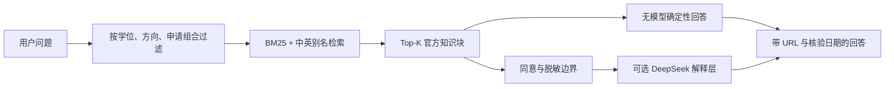

# OfferPilot 官方知识 RAG 架构

## 结论

OfferPilot 的 RAG 服务于“可验证的项目要求问答”，不是把所有留学网页塞给模型。当前知识库只收录已完成人工核验的具体项目事实；没有来源的内容不进入检索结果，只有目录入口的课程不用于回答门槛。

## 当前链路

知识块按项目拆为三类：

1. 项目概览：学校、项目、城市、学位、方向与学制。
2. 学术与背景：官网摘录、基础成绩参考、非 211 规则和相关背景要求。
3. 先修课与语言：结构化先修课程、IELTS/英语说明和研究型条件。

检索实现位于 `api/app/services/knowledge_rag.py`，接口为 `POST /me/knowledge/search`。顾问流式接口也调用同一检索函数，避免 UI 检索和 Agent 检索产生两套事实。

## 为什么第一版不用向量数据库

当前只有 6 个已核验项目、18 个知识块。此时引入向量数据库会增加模型下载、索引更新和部署失败面，却很难提升召回。可审计 BM25 对项目名、学校别名、均分、IELTS 和先修课等精确问题更适合，也能在没有 API Key 的本地环境稳定工作。

这不是拒绝向量检索，而是给它设置明确的进入条件：

- 已核验项目达到 200 个以上；或
- 开始索引官方 PDF、课程手册和长网页正文；或
- RAG Eval 表明同义改写 Recall@3 低于 90%。

达到任一条件后采用 PostgreSQL `pgvector`，以多语言 Embedding 做语义召回，与现有 BM25 结果做 Reciprocal Rank Fusion。来源 URL、文档版本、核验日期和内容哈希仍是强制字段。

## 安全与事实边界

- RAG 语料不包含用户资料。
- 用户问题在进入 DeepSeek 前经过统一脱敏；拒绝云端处理时仅使用本地检索与规则回答。
- 模型不能修改 GPA、硬门槛、分档、申请组合或路线图。
- 检索不到证据时必须返回“没有可引用内容”，不能让模型补全事实。
- 目录覆盖数量与课程级核验数量分别统计，不能混用。

## 质量门槛

`api/evals/run_rag_eval.py` 当前包含 12 条检索正样本和 5 条库外负样本，CI 强制要求：

- 项目 Top-1 准确率不低于 90%；
- 章节 Top-1 准确率不低于 90%；
- 项目 Recall@3 为 100%；
- 引用覆盖率为 100%。
- 无答案拒答准确率为 100%。

下一阶段应增加错别字、模糊问法、多项目比较和文档版本更新用例，并从真实 Beta 查询中抽样构建匿名 Eval。
